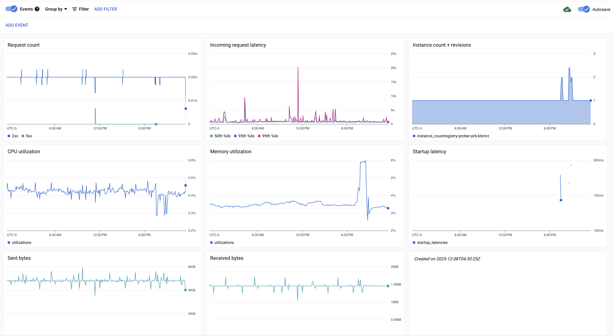

# `terraform-cloudrun-dashboard`

This module creates `google_monitoring_dashboard` resources in a repeatable structured way.

## Usage

The most basic example is a multi-regional Cloud Run dashboard:

```hcl
module "cloudrun-dashboard" {
  source       = "https://github.com/chainguard-dev/terraform-cloudrun-dashboard/cloudrun-service"
  project_id   = "[MY-PROJECT]"
  service_name = "[MY-SERVICE]"
}
```

This creates a dashboard with the following tiles:

- Request count grouped by response status
- Incoming request latency (p50,p95,p99)
- Instance count grouped by revision name
- CPU utilization
- Memory utilization
- Startup latency
- Bytes sent
- Bytes received

This can be useful if you want to get a quick overview of your Cloud Run service's performance across many regions, where the service has the same name in each region.

When exporting a dashboard from the console, there are certain fields that the console defaults to that do not get reconciled by the Terraform provider.
This results in permanent diffs during `terraform plan`.
In most cases you shouldn't have to care, except when redefining exported dashboards.

It dashboard looks something like this:



_(This is probably out of date!)_

There's also a dashboard for Cloud Run Jobs:

```hcl
module "cloudrun-job" {
  source       = "https://github.com/chainguard-dev/terraform-cloudrun-dashboard/cloudrun-job"
  project_id   = "[MY-PROJECT]"
  job_name     = "[MY-JOB]"
}
```

The dashboard modules output the URL of the dashboard in the Google Cloud Console.

## Advanced Usage: Alert Graphs

If you've defined alert policies, you can display graphs for those policies at the top of the dashboard too:

```
module "cloudrun-service" {
  source       = "https://github.com/chainguard-dev/terraform-cloudrun-dashboard/cloudrun-service"
  project_id   = "[MY-PROJECT]"
  service_name = "[MY-SERVICE]"
  alert_policies {
    "Prober": google_monitoring_alert_policy.prober.name
  }
}
```

## Advanced Usage: Customizing a dashboard with modular tiles

Tiles in the dashboard are defined as sub-modules in this repository.

This means that, in addition to just using the module directly, you can define your own module using the sub-modules as a base.

Based on [`main.tf`](./main.tf), you can create a new `google_monitoring_dashboard` resource like so:

```hcl
module "fancy" {
  source = "https://github.com/chainguard-dev/terraform-cloudrun-dashboard//tiles/xy"
  title = "Fancy Tile"
  filter = [
    "metric.type=\"run.googleapis.com/request_count\"", // Show request counts...
    "resource.type=\"cloud_run_revision\""              // ...for all Cloud Run services
  ]
  group_by_fields = ["resource.label.\"service_name\""] // ...grouped by service name
}

resource "google_monitoring_dashboard" "dashboard" {
  project = var.project_id

  dashboard_json = jsonencode({
    "displayName" : "${var.service_name} Custom Dashboard",
    "gridLayout" : {
      "columns" : 3,
      "widgets" : [
        module.fancy.tile,
        //... add more here
      ]
    }
  })
}
```
